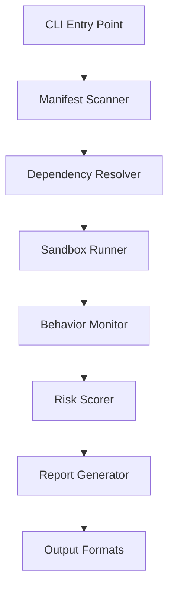

# Architecture Documentation

## System Overview

Dependency Fire Drill is a security auditing tool that tests the runtime behavior of project dependencies by executing them in isolated sandbox environments. The system monitors file system access, network connections, environment variable usage, and other potentially risky behaviors.

## High-Level Architecture



## Core Components

### 1. Manifest Scanner (`scanner.py`)
**Responsibility:** Parse package manifests and build dependency tree

- Supports `package.json`, `requirements.txt`, `Pipfile`, `pyproject.toml`
- Resolves transitive dependencies up to configurable depth
- Filters dependencies based on exclusion patterns
- Outputs structured dependency list with metadata (version, registry, etc.)

**Key Classes:**
- `DependencyScanner`: Main scanner orchestrator
- `NpmScanner`, `PipScanner`: Language-specific parsers

### 2. Sandbox Runner (`sandbox.py`, `sandbox_windows.py`)
**Responsibility:** Execute dependencies in isolated environments

**Linux/macOS:**
- Uses Docker containers with restricted capabilities
- Mounts read-only filesystem with specific write allowances
- Configures network isolation (can block external connections)
- Applies seccomp/AppArmor profiles for syscall filtering

**Windows:**
- Uses Windows Sandbox API (requires Windows 10 Pro+)
- Falls back to restricted PowerShell execution
- Monitors process activity via ETW (Event Tracing for Windows)

**Key Classes:**
- `SandboxRunner`: Platform-agnostic interface
- `DockerSandbox`, `WindowsSandbox`: Platform-specific implementations

### 3. Behavior Monitor (`monitor.py`)
**Responsibility:** Track and log dependency runtime behavior

**Monitored Activities:**
- File system: reads, writes, deletes (with full paths)
- Network: connection attempts (IP, port, protocol)
- Environment: accessed variables (names only, not values)
- Processes: child process spawning
- Code execution: detection of `eval()`, `exec()`, etc.

**Implementation:**
- Linux: `strace`/`ptrace` syscall interception
- macOS: `dtruss`/DTrace
- Windows: ETW event collection

### 4. Risk Scorer (`risk_scorer.py`)
**Responsibility:** Calculate risk scores based on observed behaviors

**Scoring Algorithm:**
```
Risk Score = max(individual_behavior_weights)
```

Each behavior has a weight (0-100):
- System file writes: 100 (critical)
- Sensitive file reads (`.ssh`, `.aws`): 80
- Environment secret access: 80
- External network connections: 50
- Home directory writes: 50
- Subprocess spawning: 60
- Eval/exec usage: 70

**Risk Levels:**
- 0-29: LOW
- 30-59: MEDIUM
- 60-79: HIGH
- 80-100: CRITICAL

### 5. Report Generator (`reporter.py`)
**Responsibility:** Format scan results for human/machine consumption

**Output Formats:**
- **Terminal:** Rich-formatted tables with colors
- **JSON:** Machine-parseable structured data
- **Markdown:** GitHub-compatible documentation
- **HTML:** Interactive reports with charts/graphs

**Report Structure:**
```json
{
  "metadata": {
    "scan_time": "ISO-8601 timestamp",
    "manifest": "path/to/manifest",
    "total_dependencies": 42
  },
  "results": [
    {
      "name": "package-name",
      "version": "1.2.3",
      "risk_score": 75,
      "risk_level": "HIGH",
      "behaviors": {
        "file_access": {"reads": [...], "writes": [...]},
        "network_access": [...],
        "env_access": [...]
      }
    }
  ]
}
```

## Data Flow

### Scan Execution Flow

1. **Input:** User runs `fire-drill scan --manifest package.json`
2. **Manifest Parsing:** Scanner identifies dependencies
3. **Dependency Resolution:** Transitive deps resolved (if `--max-depth > 1`)
4. **Exclusion Filtering:** Patterns applied to skip safe deps
5. **Sandbox Execution:** Each dependency tested in isolation
   - Install package in clean environment
   - Import/require package (triggers initialization code)
   - Monitor for 30 seconds (configurable)
   - Log all behaviors
6. **Risk Scoring:** Behaviors mapped to risk scores
7. **Report Generation:** Results formatted per `--format` flag
8. **Output:** Written to file or stdout

### Comparison Flow

1. **Input:** User runs `fire-drill compare --baseline old.json --current new.json`
2. **Report Loading:** Both JSON reports parsed
3. **Diff Calculation:** 
   - Match dependencies by name
   - Compare risk scores
   - Identify new/removed behaviors
4. **Regression Detection:** Flag dependencies with increased risk
5. **Output:** Diff report showing changes

## Security Model

### Threat Model
**Assumption:** A compromised dependency will attempt to:
- Exfiltrate source code or secrets
- Install backdoors or malware
- Modify system files
- Establish persistent network connections

**Mitigation:** Sandbox prevents actual damage; monitoring reveals intent

### Sandbox Isolation

**Docker Sandbox (Linux/macOS):**
```bash
docker run --rm \
  --network none \           # No network access (optional)
  --read-only \              # Read-only root filesystem
  --tmpfs /tmp:rw \          # Writable tmp
  --security-opt no-new-privileges \
  --cap-drop ALL \           # Drop all capabilities
  --user 1000:1000 \         # Non-root user
  <language-image> \
  <test-script>
```

**Monitored Syscalls:**
- `open`, `openat`, `creat`, `unlink`
- `connect`, `sendto`, `recvfrom`
- `execve`, `clone`, `fork`
- `getenv`, `setenv`

### Limitations
- Cannot detect time-delayed attacks (bombs set for future execution)
- May miss attacks that activate only under specific conditions
- Sandbox escape vulnerabilities could allow bypassing monitoring

## Configuration System

### Config File Resolution Order
1. `--config` CLI flag (explicit path)
2. `.firedrillrc` in current directory
3. `.firedrill.yaml` in current directory
4. `pyproject.toml` `[tool.firedrill]` section
5. Default values

### Config Schema
```yaml
# .firedrillrc
timeout: 60                 # Seconds per dependency test
max-depth: 2                # Dependency tree depth
parallel: 4                 # Concurrent sandbox workers
output-format: json         # Default format
fail-threshold: 80          # CI mode: fail if score >= this

exclusions:
  - "@types/*"              # Glob patterns
  - "/eslint-.*/"           # Regex patterns

sandbox-profile: strict     # Sandbox restriction level

risk-config: ./custom-risk.yaml  # Custom risk weights
```

## Extension Points

### Adding Language Support
1. Implement `LanguageScanner` subclass in `scanner.py`
2. Add manifest parser (e.g., `Gemfile` for Ruby)
3. Create Docker image with language runtime
4. Update `SandboxRunner` to handle new language
5. Add tests in `tests/test_scanner_<lang>.py`

### Custom Sandbox Profiles
Create YAML file defining allowed operations:

```yaml
name: my-profile
base: standard
allow:
  network:
    - "127.0.0.1"          # Localhost only
  files:
    read: ["**/*.json"]    # Read any JSON
    write: ["/tmp/**"]     # Write to tmp only
```

### Custom Risk Scoring
Override weights in risk config:

```yaml
weights:
  custom_behavior: 95
  file_write_system: 100  # Override default
```

Then implement detection in `BehaviorMonitor`.

## Performance Characteristics

### Benchmarks (MacBook Pro M1, 16GB RAM)
- **Small project (20 deps):** ~2 minutes
- **Medium project (100 deps):** ~8 minutes
- **Large project (500 deps):** ~40 minutes (with `--parallel 8`)

### Optimization Strategies
- **Parallel execution:** `--parallel N` (default: 4)
- **Sampling:** `--sample 50` (test random subset)
- **Quick scan:** `--max-depth 1` (skip transitive deps)
- **Caching:** Future enhancement (cache results by package@version)

## Future Enhancements

### Planned Features (v0.3.0)
- Result caching (avoid re-testing unchanged deps)
- Ruby/Go/Rust language support
- SBOM (Software Bill of Materials) export
- Integration with GitHub Advanced Security

### Research Areas
- Machine learning for anomaly detection
- Static analysis integration (combine with runtime testing)
- Honeypot mode (simulate sensitive files to detect exfiltration)
